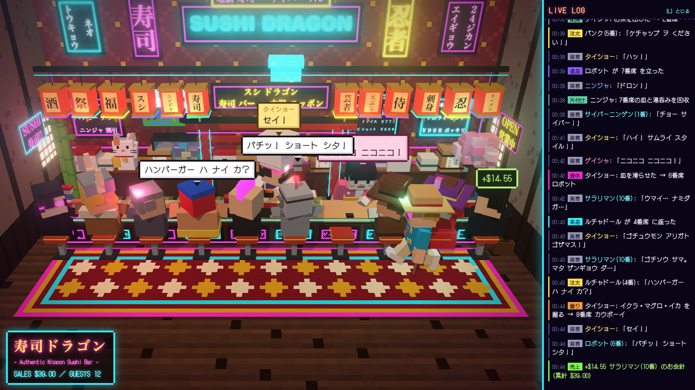

# 寿司ドラゴン — 外国人が勘違いした日本の寿司屋（Three.js ボクセルアート）

「外国人が想像した日本」をテーマにした、ボクセルアートの寿司屋シミュレーションです。
客席側の固定カメラから、カウンターと店内を眺めます。ビルド不要で、ブラウザだけで動きます。



動画: [`video/sushi-dragon.mp4`](video/sushi-dragon.mp4)（30秒 / 1280×720 / 約4.6MB）

## 起動方法

ES Modules を使うため、`file://` では動きません。ローカルサーバーを立てて開いてください。

```bash
python3 -m http.server 8765
# → http://localhost:8765/
```

three.js 本体・ポストプロセス（ブルーム）・ドット絵フォント（DotGothic16）は `vendor/` と `fonts/` に同梱しているので、オフラインでも動きます。

## 見どころ

- **店内**: 鳥居、赤い提灯、水槽、手を振る招き猫、富士山と五重塔の絵、桜と竹。看板の文字は明朝体で、「おマミ」「サケ ジュース」「ワサビ 爆盛」のような変な日本語です。
- **サイバー感**: 夜のネオン街の雰囲気。ネオン看板、カウンターのライン、光る絨毯の縁、浮かぶホログラム寿司、ブルームによる光の滲み。
- **登場人物**
  - 店主（タイショー）: 寿司を握り、皿をカウンターで客へ滑らせます（西部劇スタイル）。客と雑談もします。
  - ウェイトレス（ゲイシャ）: お茶を運びます。カウンターを拭き、カメラに手を振ります。
  - 忍者: カウンターの上に現れて皿を回収し、ジャンプして消えます。ときどき走り抜ける演出もあります。
  - 客（10種類）: カウボーイ / 観光客 / ビジネスマン / パンク / バイキング / マダム / ルチャドール / サラリマン / サイバー（目がネオンのバイザー） / ロボット
- **客の一連の動き**: 来店 → 着席 → 注文 → 待つ → 皿が滑ってくる → 食べる（箸・フォーク・手） → お茶 → お会計 → 退店。
  - 個別の演出: 観光客は写真を撮る、パンクはワサビ全乗せで悶絶、バイキングは乾杯、ルチャドールはポーズ、サラリマンは居眠り、ロボットはショートする。
- **ドット絵風の吹き出し**: 店主は黄、店員はピンク、忍者は黒、客は白。
- **ライブログ（右パネル）**: 来店・注文・握り・提供・売上・退店・セリフが時刻付きで流れます。

## 操作・URLパラメータ

| 指定 | 内容 |
| --- | --- |
| `L` キー | ログパネルの表示切り替え（幅 900px 未満では非表示） |
| `?speed=1.5` | 全体の進行速度。既定は 1.5、`1` で等速 |
| `?bloom=0.5` | ブルームの強さ。`0` で無効 |
| `?warp=30` | 起動時にシミュレーションを N 秒先まで進める（確認用） |
| `?first=cyber,robot` | 最初に座る客の種類を指定（確認用） |
| `?record=1` | 録画モード。自動進行を止め、`window.__advance(dt, sub)` で1フレームずつ進める |

サイバー度は `util.js` の `NEON_GAIN`（既定 0.62）で一括調整できます。

## ファイル構成

| ファイル | 役割 |
| --- | --- |
| `index.html` | ページ、吹き出し・ログ・HUD の CSS、importmap |
| `main.js` | レンダラー・カメラ・ブルーム、吹き出しとログ、店主・店員・忍者・客のシナリオ（ジェネレータ） |
| `world.js` | 店内（床・壁・カウンター・鳥居・提灯・看板・ネオン・水槽・招き猫など）とライティング |
| `actors.js` | ボクセル人形 `Actor` クラスと、客・店員の見た目定義 `LOOKS` |
| `items.js` | 皿・寿司・湯呑み・箸・フォーク・盆・包丁・カメラなどの小物 |
| `util.js` | 箱ヘルパー `B()`、明朝体の看板テクスチャ、ネオンマテリアル、ジェネレータ用ユーティリティ、パーティクル |
| `vendor/` | three.js r160 とポストプロセス（EffectComposer / UnrealBloomPass） |
| `fonts/` | DotGothic16（吹き出し・ログ用のドット絵フォント） |
| `tools/shot.sh` | ヘッドレス Chrome で静止画を撮る |
| `tools/record.mjs` | 1フレームずつ撮って動画用の連番画像にする |
| `screenshots/`, `video/` | 確認用スクリーンショットと書き出した動画 |

## 動画の作り方

`puppeteer-core` と `ffmpeg` が必要です（Chrome は macOS のものを使います）。

```bash
python3 -m http.server 8765 &
npm i puppeteer-core
node tools/record.mjs /tmp/frames \
  "http://localhost:8765/index.html?record=1&warp=4&first=salaryman,cyber,robot,cowboy,punk"
ffmpeg -framerate 24 -i /tmp/frames/%05d.jpg -c:v libx264 -preset slow -crf 27 \
  -pix_fmt yuv420p -movflags +faststart video/sushi-dragon.mp4
```

長さ・解像度・fps は `tools/record.mjs` の先頭の定数で変えられます。
静止画だけ欲しいときは `tools/shot.sh <warp秒> <出力.png>` が手軽です。

## 仕組みのメモ

- キャラクターや小物はすべて直方体（`B()` ヘルパー）の組み合わせです。
- 客・店員の動きは `function*`（ジェネレータ）で書いた台本で、`yield* wait(秒)` や `yield* until(条件)` で進みます。`util.js` の `spawn()` / `runTasks()` が毎フレーム進行させます。
- 腕は「目標点に向ける」方式（`aimWorld` / `aimLocal`）で、届かない距離は腕を少し伸ばして補います。
- ネオンは、1 を超える輝度のマテリアル（`neonMat`）をブルームのしきい値超えで光らせています。

## ライセンス・クレジット

- コード（`main.js` `world.js` `actors.js` `items.js` `util.js` `tools/`）: このプロジェクト独自のもの。公開時にライセンスを付ける場合はここに追記してください。
- [three.js](https://threejs.org/) r160（`vendor/`）: MIT License
- [DotGothic16](https://fonts.google.com/specimen/DotGothic16)（`fonts/`）: SIL Open Font License 1.1（`fonts/OFL.txt` を同梱）
- 店の名前・看板・キャラクターはすべて架空のパロディです。「外国人が想像した日本」を誇張して遊んでいるもので、実在の店・団体・人物とは関係ありません。
